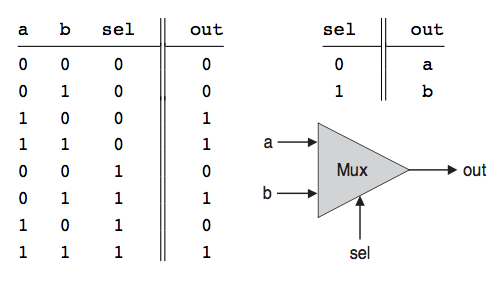
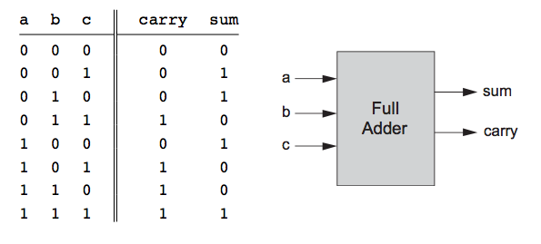
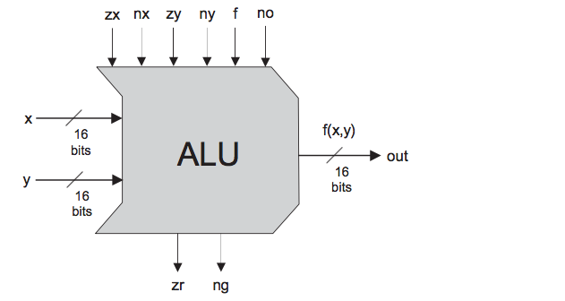
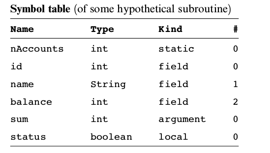

# Nand2Tetris
Nand2Tetris: Build a computer system from the ground up, from nand to tetris. Hardware and software.

### [Chapter 1: Boolean logic](nand2tetris/projects/01)
* **Truth table representation**
* **Canonical representation**
* **Logic gates**
    * Nand(a, b)
    * Not(in)
    * And(a, b)
    * Or(a, b)
    * Xor(a, b)
    * Mux(a, b, sel) multiplexor choose one from many
    
    * DMux(in, sel)
     

### [Chapter 2: Boolean arithmetic](nand2tetris/projects/02)
* **Signed Binary Number**: Most computer systems today use the method called *2's complement*, aka *radix complement*. In 2's complement of n bits, x + (minus) x = 2 to the n. With *radix complement* we don't need to care about substraction operation. We can substract with add operation. That's super cool. So we only need Adders chip.
 

* **HalfAdder**
 

* **Full Adder**
 

* **ALU**
 

### [Chapter 3: Sequential logic](nand2tetris/projects/03)
* **Combinational vs Sequential Logic**
 
    * **Combinational Logic**: An implementation of boolean function. The output depends on only the input. Meaning with a certain input there is a certain output.
    * **Sequential Logic**
        * Use clock
        * Maintain state
        * Output depends on input and the current state
    * [Good explaination of differences between Combinational and Sequential](https://www.cs.umd.edu/class/sum2003/cmsc311/Notes/Seq/diff.html)

* **Data Flip-Flop (DFF)** contains a clock input, a gate's input and a gate's output. DFF behavior is *out(t) = in(t-1)* where t is the current clock cycle. 

* **1-bit Register (Bit)** is a storage device. It can *store*(remember) a value over time. Its behavior is *out(t) = out(t-1)*
 

### [Chapter 4: Machine language](nand2tetris/projects/04)
### [Chapter 5: Computer architecture](nand2tetris/projects/05)
### [Chapter 6: Assembler](nand2tetris/projects/06)
### [Chapter 7: Virtual machine I - Stack arithmetic](nand2tetris/projects/07) 
### [Chapter 8: Virtual machine II - Program control](nand2tetris/projects/08)
### [Chapter 9: High-level language](nand2tetris/projects/09)
### [Chapter 10: Compiler I - Syntax analysis](nand2tetris/projects/10)

### [Chapter 11: Compiler II - Code generation](nand2tetris/projects/11)
The compilation of high-level programming language into a low-level one focuses on 2 main issues: ***data translation*** and ***command translation***
#### 11.1 Data translation
* **Variables** For variables we need to care about some of its properties
    * *type*: integer, char, boolean, array, object
    * *kind*: field, static, local, argument
    * *scope*: class level, subroutine level
* **Symbol table**: A data structure to keep track all *identifiers*. Whenever a new *identifier* is encountered for the first time the compiler adds its description to *symbol table*. Whennever an *identifies* is encountered elsewhere in the source code the compiler looks it up in symbol table and get all information needed from symbol table.

* **Handling variable**

* **Handling object**

* **Handling array**

#### 11.2 Command translation
* **Handling expression**

* **Handling flow of control**

### [Chapter 12: Operating system](nand2tetris/projects/12)
